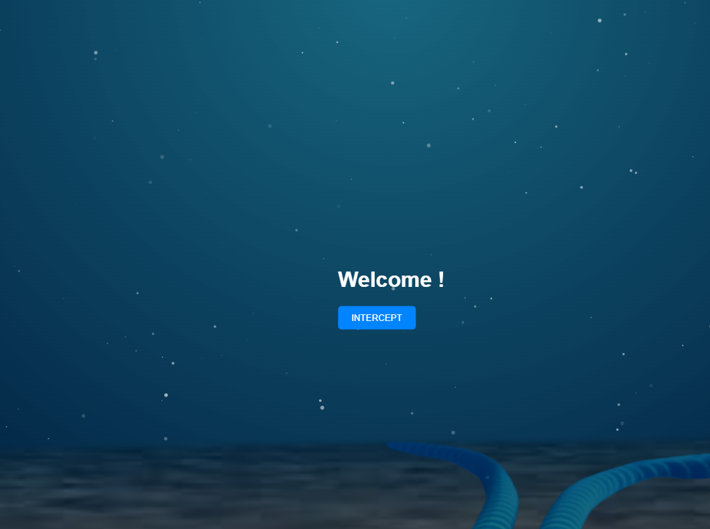

# Challenge: DeepDove

Listen carefully to what you hear. Choose your identity and retrieve the flag in this never before seen challenge !

## 🎯 Goal
When we enter for the first time in this website we can clearly see that we need to become an admin to access an administration panel.

As we can see we're guest and we can confirm that with a cookie :

## 🔍 Analyse & Recon

After analyse we can clearly say that the server know who am I with the cookie, if I change my cookie to an other one, nothing change. But if I find the right cookie that's equal to an admin session it will works.

The value of MyHashedSessionId is a MD5 hash.

## 🛠️ Exploitation / Solution

To resolve this challenge we can crack the hash with https://crackstation.net/

As we can see i'm 606.

Now we can create a script that enumerate all number between 0 and 1000 and find if something change in the page for a specific number.

Bingo !

The flag is in the administration panel.

